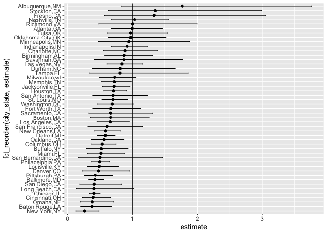
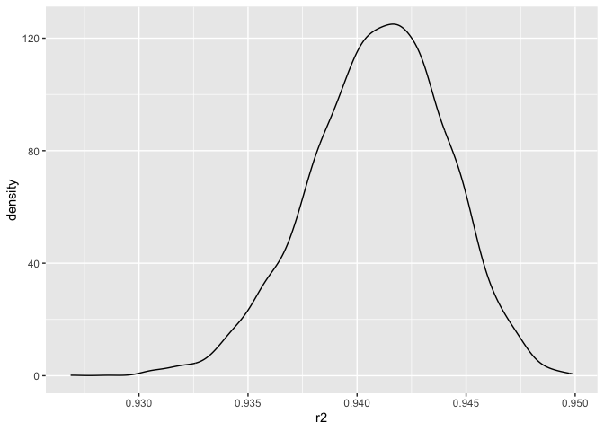
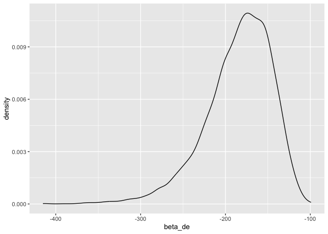

P8105 HW6
================
Jingfeng Cao

## Problem 1

``` r
library(tidyverse)
```

    ## ── Attaching core tidyverse packages ──────────────────────── tidyverse 2.0.0 ──
    ## ✔ dplyr     1.1.4     ✔ readr     2.1.5
    ## ✔ forcats   1.0.0     ✔ stringr   1.5.1
    ## ✔ ggplot2   3.5.2     ✔ tibble    3.3.0
    ## ✔ lubridate 1.9.4     ✔ tidyr     1.3.1
    ## ✔ purrr     1.1.0     
    ## ── Conflicts ────────────────────────────────────────── tidyverse_conflicts() ──
    ## ✖ dplyr::filter() masks stats::filter()
    ## ✖ dplyr::lag()    masks stats::lag()
    ## ℹ Use the conflicted package (<http://conflicted.r-lib.org/>) to force all conflicts to become errors

``` r
library(purrr)
library(broom)
```

``` r
homicide_df = read_csv('data/homicide-data.csv') |>
  mutate(city_state = paste(city, state, sep = ','), unsolved = disposition %in% c('Closed without arrest', 'Open/No arrest')) |>
  filter(!city_state %in% c('Dallas,TX', 'Phoenix,AZ', 'Kansas City,MO', 'Tulsa,AL')) |>
  filter(victim_race %in% c('White', 'Black')) |>
  mutate(victim_age = as.numeric(victim_age))
```

    ## Rows: 52179 Columns: 12
    ## ── Column specification ────────────────────────────────────────────────────────
    ## Delimiter: ","
    ## chr (9): uid, victim_last, victim_first, victim_race, victim_age, victim_sex...
    ## dbl (3): reported_date, lat, lon
    ## 
    ## ℹ Use `spec()` to retrieve the full column specification for this data.
    ## ℹ Specify the column types or set `show_col_types = FALSE` to quiet this message.

    ## Warning: There was 1 warning in `mutate()`.
    ## ℹ In argument: `victim_age = as.numeric(victim_age)`.
    ## Caused by warning:
    ## ! NAs introduced by coercion

for Baltimore, MD

``` r
Baltimore_MD = homicide_df |>
  filter(city_state == 'Baltimore,MD') |>
  mutate(resolved = !unsolved) |>
  glm(resolved ~ victim_age + victim_sex + victim_race, data = _, family = binomial()) |>
  broom::tidy(conf.int = TRUE, exponentiate = TRUE)
Baltimore_MD
```

    ## # A tibble: 4 × 7
    ##   term             estimate std.error statistic  p.value conf.low conf.high
    ##   <chr>               <dbl>     <dbl>     <dbl>    <dbl>    <dbl>     <dbl>
    ## 1 (Intercept)         1.36    0.171        1.81 7.04e- 2    0.976     1.91 
    ## 2 victim_age          0.993   0.00332     -2.02 4.30e- 2    0.987     1.000
    ## 3 victim_sexMale      0.426   0.138       -6.18 6.26e-10    0.324     0.558
    ## 4 victim_raceWhite    2.32    0.175        4.82 1.45e- 6    1.65      3.28

``` r
Baltimore_MD_victim_sexMale = Baltimore_MD |>
  filter(term == 'victim_sexMale')
Baltimore_MD_victim_sexMale
```

    ## # A tibble: 1 × 7
    ##   term           estimate std.error statistic  p.value conf.low conf.high
    ##   <chr>             <dbl>     <dbl>     <dbl>    <dbl>    <dbl>     <dbl>
    ## 1 victim_sexMale    0.426     0.138     -6.18 6.26e-10    0.324     0.558

estimate is 0.426 and confidence interval is (0.324,0.558)

For all cities

``` r
result1 = homicide_df |>
  mutate(resolved = !unsolved) |>
  filter(victim_sex != 'Unknown') |>
  group_by(city_state) |>
  nest() |>
  mutate(model = map(data, ~ glm(resolved ~ victim_age + victim_sex + victim_race, data = .x, family = binomial()))) |>
  mutate(tidied = map(model, ~ tidy(.x, conf.int = TRUE, exponentiate = TRUE))) |>
  unnest(tidied) |>
  select(-model,-data) |>
  filter(term == 'victim_sexMale') |>
  select(city_state, estimate, conf.low, conf.high)
result1
```

    ## # A tibble: 47 × 4
    ## # Groups:   city_state [47]
    ##    city_state     estimate conf.low conf.high
    ##    <chr>             <dbl>    <dbl>     <dbl>
    ##  1 Albuquerque,NM    1.77     0.825     3.76 
    ##  2 Atlanta,GA        1.00     0.680     1.46 
    ##  3 Baltimore,MD      0.426    0.324     0.558
    ##  4 Baton Rouge,LA    0.381    0.204     0.684
    ##  5 Birmingham,AL     0.870    0.571     1.31 
    ##  6 Boston,MA         0.667    0.351     1.26 
    ##  7 Buffalo,NY        0.521    0.288     0.936
    ##  8 Charlotte,NC      0.884    0.551     1.39 
    ##  9 Chicago,IL        0.410    0.336     0.501
    ## 10 Cincinnati,OH     0.400    0.231     0.667
    ## # ℹ 37 more rows

``` r
result1_plot = result1 |>
  arrange(estimate) |>
  ggplot(aes(x = fct_reorder(city_state, estimate), y = estimate)) + geom_point() + geom_errorbar(aes(ymin = conf.low, ymax = conf.high), width = 0.2) + geom_hline(yintercept = 1) + coord_flip()
result1_plot
```

<!-- -->

different cities have different result and most cities’ estimate OR is
less than 1. For cities whose OR is more than 1, its CI include 1, which
means there is no significant difference between sex. But some cities
like New York, we can see significant lower resolved case rate in women.

## Problem 2

``` r
library(p8105.datasets)
data("weather_df")
weather_df = weather_df |>
  select(tmax,tmin,prcp) |>
  drop_na()
```

``` r
boot_sample = function(df) {sample_frac(df, replace = TRUE)}
```

``` r
boot_straps = 
  tibble(strap_number = 1:5000) |> 
  mutate(strap_sample = map(strap_number, \(i) boot_sample(df = weather_df)), results = map(strap_sample, \(x) lm(tmax ~ tmin + prcp, data = x)))
```

``` r
boot_result = boot_straps |>
  select(-strap_sample) |>
  mutate(r2 = map_dbl(results, \(x) glance(x)$r.squared), tidy = map(results, \(x) tidy(x))) |>
  select(-results) |>
  mutate(beta_de = map_dbl(tidy, \(x) {
    b1 = x$estimate[x$term == 'tmin']
    b2 = x$estimate[x$term == 'prcp']
    b1 / b2})) |>
  select(-tidy)
```

``` r
r2_plot = boot_result |> 
  ggplot(aes(x = r2)) + geom_density()
r2_plot
```

<!-- -->

It is approximately bell-shaped with slightly left skewed tail, and
almost all r^2 is more than 0.93.

``` r
beta_plot = boot_result |>
  ggplot(aes(x = beta_de)) + geom_density()
beta_plot
```

<!-- -->

It has a left tail, and the peak is at about -160.

``` r
CI_table = boot_result |>
  summarize(r2_low = quantile(r2, 0.025), r2_high = quantile(r2, 0.975), beta_low = quantile(beta_de, 0.025), beta_high = quantile(beta_de, 0.975)) |>
  knitr::kable()
CI_table
```

|    r2_low |   r2_high |  beta_low | beta_high |
|----------:|----------:|----------:|----------:|
| 0.9344278 | 0.9466046 | -278.6629 | -125.0794 |

## Problem 3
